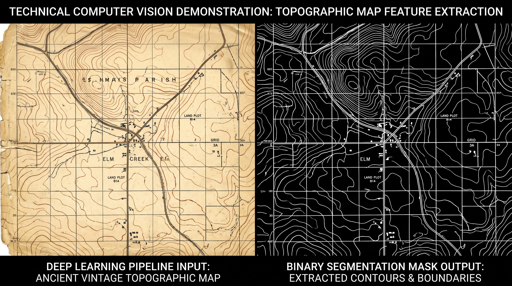

# Scanned Map Segmentation with U-Net

A computer-vision experiment for extracting map features from scanned documents. The repository contains a six-channel RGB/HSV U-Net training script and a separate patch-based inference experiment.



## What the code demonstrates

- RGB/HSV feature preparation and paired image-mask training data.
- An encoder-decoder network with skip connections, batch normalization, and regularization.
- Binary cross-entropy and Dice-based loss functions, checkpointing, and training plots.
- Patch prediction and weighted reconstruction for large images.

## Repository guide

| File | Purpose |
| --- | --- |
| [train_unet.py](src/train_unet.py) | Data preparation, U-Net definition, training, and evaluation |
| [inference_patch.py](src/inference_patch.py) | Three-channel, 64×64 patch inference and reconstruction experiment |
| [requirements.txt](requirements.txt) | Dependency lower bounds; not a frozen training environment |

## Setup and reproduction

Training images, masks, and trained models are not included. The scripts retain machine-specific paths and require adaptation before execution.

### Install dependencies

Run these commands from a terminal with Python available:

```bash
git clone https://github.com/Panutle/scanmap-unet-segmentation.git
cd scanmap-unet-segmentation
python -m venv .venv
```

Activate the environment using the command for your shell:

| Shell | Command |
| --- | --- |
| Windows PowerShell | `.\.venv\Scripts\Activate.ps1` |
| macOS / Linux | `source .venv/bin/activate` |

```bash
python -m pip install -r requirements.txt
```

The inference script also imports Pandas, which is absent from `requirements.txt`:

```bash
python -m pip install pandas
```

### Training

1. Update the `Variable` path helpers in `src/train_unet.py` for your paired input and mask directories and output locations. The loader expects matching image and mask filenames.
2. Prepare 512×512 image/mask pairs for the default training configuration, and create the required output directories.
3. Review `epochs`, `n_train_step`, `n_train_data`, and `batch` before running; the stored values target long experiments.
4. Replace or disable the training notification endpoint for your environment.

```bash
python src/train_unet.py
```

### Inference compatibility

The checked-in inference script uses **64×64 RGB inputs**, while training defaults to **512×512, six-channel inputs**. A model produced with the default training configuration cannot be assumed to work with this inference script. Supply a compatible model or first align the input shape, feature preprocessing, output channels, and custom loss loading.

Update the input image, model, temporary patch directory, prediction directory, and hard-coded `img_shape` in `src/inference_patch.py`. The extraction and reconstruction loops use different edge conditions; align their patch counts and decide how to pad or crop boundary pixels before running on a new image size.

After those adaptations, the entry point is:

```bash
python src/inference_patch.py
```

The final image is written as `Final_con.bmp` in the working directory.

## Evaluation scope

The preview illustrates a segmentation result. A held-out dataset, aggregate segmentation scores, runtime benchmark, and trained checkpoint are not bundled. The example image dimensions are in the tens of megapixels; the repository does not establish gigapixel processing performance. TensorFlow/Keras compatibility and memory requirements must be validated for the chosen environment.
