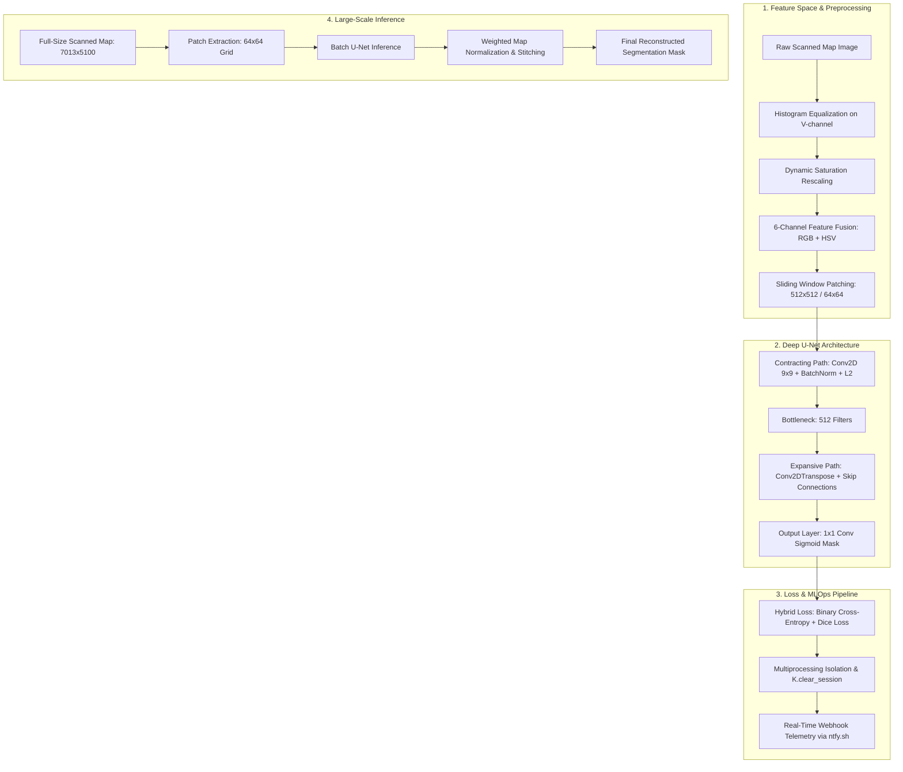

# DeepScanMap: High-Resolution Map Feature Segmentation via Custom Deep U-Net

[](https://python.org)
[](https://tensorflow.org)
[](https://opencv.org)
[]()

An end-to-end Computer Vision and Deep Learning framework designed for semantic segmentation of ultra-high-resolution scanned cartographic documents and maps. The system handles large-scale gigapixel raster imagery through a sliding-window patch decomposition and reconstruction pipeline, training a deeply parameterized U-Net architecture powered by multi-spectral feature expansion (RGB + HSV) and hybrid loss optimization.

---

## 📌 Demonstration & Visual Output

<div align="center">
  
  <p><em>Figure: Side-by-side comparison between the raw scanned vintage map input and the extracted binary contour/boundary segmentation mask produced by the custom Deep U-Net pipeline.</em></p>
</div>

---

## 📌 Architectural Overview



---

## ⚙️ Core Technical Highlights

### 1. 6-Channel Chromatic Feature Space (RGB + HSV Fusion)
To isolate map features (lines, symbols, terrain boundaries) from aging paper and uneven scanning illumination:
* **Adaptive Contrast Enhancement:** Implements histogram equalization specifically on the Value ($V$) channel, followed by dynamic Saturation ($S$) scaling restricted within $[0.8, 2.0]$.
* **Multi-Modal Color Fusion:** Combines normalized RGB $[0, 1]$ and normalized HSV $[0, 1]$ into a unified 6-channel tensor $(512 \times 512 \times 6)$, providing both structural color balance and lighting-invariant chromatic representations.

### 2. Deep U-Net Architecture with Receptive Field Expansion
* **Large Kernel Convolutions ($9 \times 9$):** Replaces standard $3 \times 3$ filters with wider $9 \times 9$ receptive fields across encoder/decoder blocks $(64 \rightarrow 128 \rightarrow 256 \rightarrow 512)$, capturing extended map line continuity and contextual geometries.
* **Regularization & Stability:** Integrates `BatchNormalization` after each convolution block and enforces $L_2$ kernel regularization ($10^{-4}$) with `HeNormal` weight initialization to prevent gradient vanishing and overfitting.
* **Skip Connections:** Long skip connections bridge high-resolution spatial boundaries from the encoder directly to the decoder path (`Conv2DTranspose`), preserving fine-grained border details.

### 3. Hybrid Optimization: Dice Loss + Binary Cross-Entropy
To address severe class imbalance where target map markings occupy a tiny fraction of the total raster area:

$$\mathcal{L}_{\text{Total}} = \mathcal{L}_{\text{BCE}} + \mathcal{L}_{\text{Dice}}$$

$$\mathcal{L}_{\text{Dice}} = 1 - \frac{2 \sum (y_{\text{true}} \cdot y_{\text{pred}}) + 1}{\sum y_{\text{true}} + \sum y_{\text{pred}} + 1}$$

### 4. Enterprise Memory Management & Multi-Processing Isolation
* **Hardware Stability:** Enables `set_memory_growth` for GPU acceleration on modern hardware (Apple Silicon / NVIDIA).
* **Process Isolation:** Runs incremental training cycles (`n_train_step = 1000`) and intermediate evaluation inside discrete `multiprocessing.Process` workers, followed by explicit `K.clear_session()` and `gc.collect()`, eradicating long-running TensorFlow memory leaks.
* **Automated MLOps Telemetry:** Dispatches real-time training notifications (model parameters, validation accuracy, duration) to mobile devices via webhook alerts (`ntfy.sh`).

### 5. Seamless Gigapixel Patch Reconstruction
* Processes ultra-large raster inputs (e.g., $7013 \times 5100$ pixels) that exceed standard GPU VRAM capacities.
* Deconstructs input images into a regular $64 \times 64$ patch matrix, executes batched U-Net inference, and stitches outputs using a normalized weighting accumulator map to eliminate border stitching artifacts.

---

## 📂 Repository Structure

```text
scanmap-unet-segmentation/
├── docs/
│   └── demo_segmentation_io.jpg  # Input vs Output segmentation preview
├── src/
│   ├── train_unet.py             # 6-channel data preprocessing, U-Net training, and MLOps loops
│   └── inference_patch.py        # Patch extraction, batched prediction, and full-image reconstruction
├── requirements.txt              # Project dependencies
└── README.md
```

---

## 🚀 Getting Started

### 1. Installation
```bash
git clone https://github.com/Panutle/scanmap-unet-segmentation.git
cd scanmap-unet-segmentation
pip install -r requirements.txt
```

### 2. Model Training
```bash
python src/train_unet.py
```

### 3. Full Map Inference & Mask Reconstruction
```bash
python src/inference_patch.py
```#
